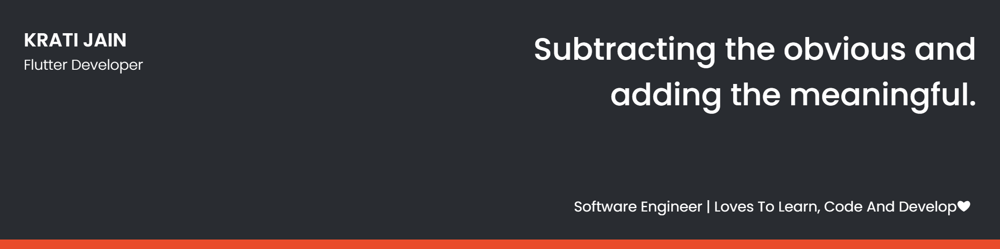

## 👩 About Me

- 🔭 I’m currently pursuing Software Engineering

- 🌱 I'm a Flutter Developer.

- 👯 I loves to collaborate an learn new technologies.

- 📫 Contact me **[here](kratijain1600@gmail.com)**

## ✍ My Work

Here are some of my projects on Github:

## 📚 My Skills

## 🤝 Connect

